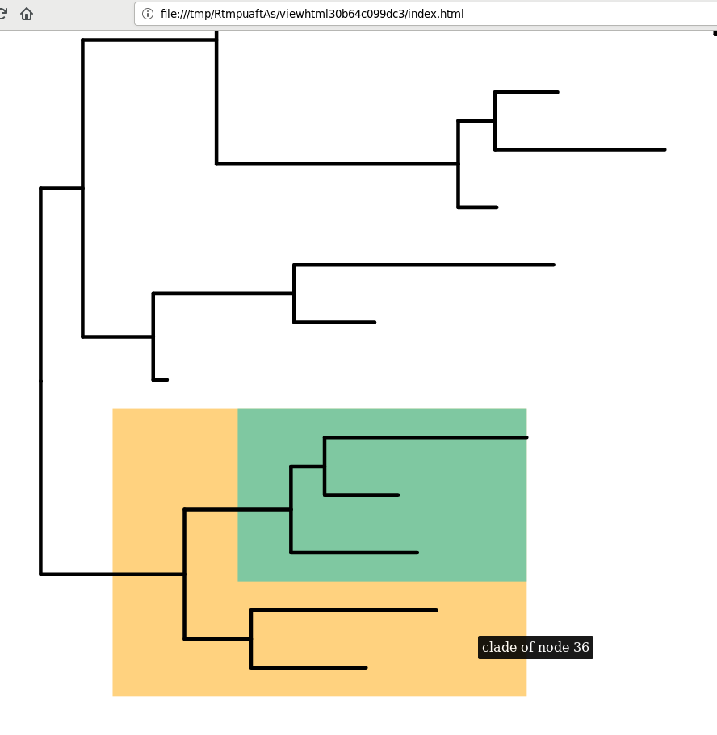

<!-- README.md is generated from README.Rmd. Please edit that file -->

# iggtree: Provide basic components for the interactive version of ggtree

## :newspaper: Description

What the package does (one paragraph).

## :writing\_hand: Author

[Shuangbin Xu](https://github.com/xiangpin) and [Guangchuang
Yu](https://guangchuangyu.github.io)

School of Basic Medical Sciences, Southern Medical University

## :arrow\_double\_down: Installation

``` r
#It can be installed via GitHub.
if (!requireNamespace("remotes", quietly=TRUE))
    install.packages("remotes")
remotes::install_github("YuLab-SMU/iggtree")
```

## :newspaper: Usage

``` r
library(ggplot2)
library(ggiraph)
library(iggtree)
# Note: the ggtree should be re-installed via
# remotes::install_github("xiangpin/ggtree@use_iggtree_ggiraph")
library(ggtree)

set.seed(123)
tr <- rtree(20)
dt <- data.frame(id = c(36, 38), type=c("A", "B"))
p <- ggtree(
       tr, 
       mapping = aes(
           tooltip = round(branch.length, 2), 
           data_id = node
         )
     ) +
     geom_hilight(
        data = dt, 
        mapping = aes(
           node = id, 
           fill = type, 
           tooltip = paste0("clade of node ", id), 
           data_id = type
        ), 
        to.bottom = TRUE
     )

girafe(ggobj = p)
```



## :sparkling\_heart: Contributing

We welcome any contributions\! By participating in this project you
agree to abide by the terms outlined in the [Contributor Code of
Conduct](CONDUCT.md).
